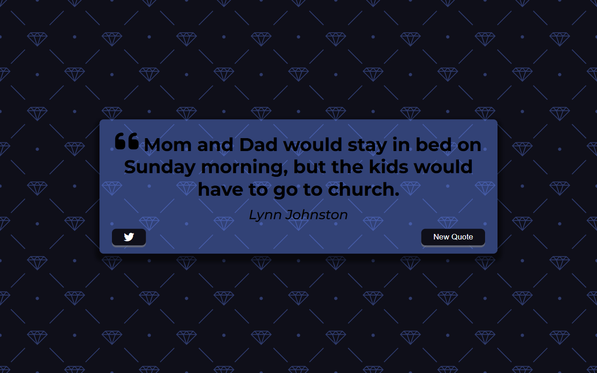

# Quote Generator | ZTM Js Web Projects Course

**Project 1/20**

A simple and aesthetic random quote generator that fetches quotes from an external API and displays them with a stylish UI. Users can view new quotes and tweet them directly.

---

## Table of contents

- [Overview](#overview)
  - [Screenshot](#screenshot)
  - [Links](#links)
  - [Features](#features)
- [My process](#my-process)
  - [Built with](#built-with)
  - [What I learned](#what-i-learned)
  - [Next Project](#next-project)
- [Author](#author)
  - [Connect with Me](#connect-with-me)
  - [Coding Profiles](#coding-profiles)

---

## Overview

### Screenshot

### Links

 - [Live Demo](https://dalascript.github.io/quote-generator/)
 - [GitHub Repository](https://github.com/DalaScript/quote-generator)

### Features

- Random quote fetched from a public API
- Author name display (or "Unknown" if missing)
- Stylish design with responsive layout
- Twitter share button
- Loader animation for smooth UX

## My Process

### Built with

- HTML5
- CSS3
- Vanilla JavaScript
- Quote API

### What I Learned

- Working with Fetch API and async/await
- Handling conditional data (e.g., unknown authors)
- UI/UX animation techniques

### Next Project

Infinite Scroll App → [View Repository](https://github.com/DalaScript/infinite-scroll)

---

## Author

### Connect with Me

- [Instagram](https://www.instagram.com/DalaScript)
- [YouTube](https://www.youtube.com/@DalaScript)

### Coding Profiles

- [freeCodeCamp](https://www.freecodecamp.org/DalaScript)
- [FrontendMentor](https://www.frontendmentor.io/profile/DalaScript)
- [GitHub](https://github.com/DalaScript)
